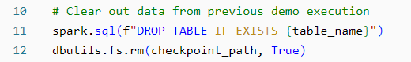

# Week11: Databricks ETL Pipeline

## Overview
This README outlines the Databricks notebook designed for extracting, transforming, and loading (ETL) data using PySpark. The notebook demonstrates the use of Auto Loader for ingesting JSON data into a Delta table and further processing CSV data.

Here is the link to the Databricks notebook: [Week11-Databricks](https://adb-636253859913156.16.azuredatabricks.net/?o=636253859913156#notebook/872663410800357)

## Requirements
- Databricks Runtime
- Access to /databricks-datasets/structured-streaming/events for JSON data
- Access to /databricks-datasets/bikeSharing/data-001/day.csv for CSV data

## Components
### Importing Functions
The notebook begins by importing necessary PySpark SQL functions:

### Variable Definitions
Variables are defined for file paths, user-specific table names, and checkpoint paths:

### Data Clearing
The notebook clears data from previous executions:

### Data Ingestion and Transformation
The notebook configures Auto Loader to ingest JSON data into a Delta table. It also adds metadata and a timestamp to the records:

### Data Display
The notebook reads and displays the created Delta table:

### Additional Data Processing
Lastly, the notebook reads and displays a CSV file:

## Usage
1. Go to the notebook and  press **SHIFT+ENTER** to run each cell of the notebook in sequence to execute the ETL process. Ensure you have the necessary access to the datasets and Databricks runtime.

2. Click **Schedule** on the right side of the header bar and run the pipeline.

3. Sample result of the pipeline

## Project Structure
- **.devcontainer** includes a Dockerfile and devcontainer.json. The **Dockerfile** within this folder specifies how the container should be built, and other settings in this directory may control development environment configurations.
- **workflows** includes GitHub Actions, which contain configuration files for setting up automated build, test, and deployment pipelines for your project.
- **.gitignore** is used to specify which files or directories should be excluded from version control when using Git.
- **Makefile** is a configuration file used in Unix-based systems for automating tasks and building software. It contains instructions and dependencies for compiling code, running tests, and other development tasks.
- **README.md** is the instruction file for the readers.
- **requirements.txt** is to specify the dependencies (libraries and packages) required to run the project.
- **test_main.py** is a test file for main.py that can successfully run in IDEs.
- **main.py** is a Python file that contains the main function.
- **Week11-Databricks.ipynb** is a IPython Notebook exported from Databricks Notebook to provide a quick review for the script.
